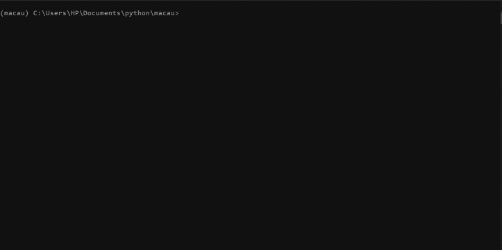

# Macau


This is the Macau project.   
Install the [Miniconda](https://docs.conda.io/en/latest/miniconda.html)
After installation please setup environment with:  
`conda env create -f environment.yml`  
Next change environment with:  
`conda activate macau`  
now you can run the game locally using `python macau.py`.

There are unit tests for this project.  
You can run tests using `pytest` in project directory.

# Rules and Features
  

This is standard [Macau](https://en.wikipedia.org/wiki/Macau_(card_game)) game.
After start of `macau.py` script you will see:  
```
Welcome to Macau Game!
How many players will play? (max is 6):
```
You can choose any number of players between 2-6.
Game window looks like:
```
Grzesiek Turn Now!

Grzesiek
---------------------Punishments---------------------
Cards: 0
Skip turns: 0
----------------------Requests-----------------------
Color: None
Value: None
-----------------------Table-------------------------
Cards in deck: 41
On top: hearts 10
------------------------Hand-------------------------
clovers 3, *hearts 3*, clovers 8, pikes 9, *hearts J*
-----------------------------------------------------
*color value* -> means that this card can be played
Which card(s) from your hand do you want to play?:
```

Cards which you can play are marked with stars `*`.  
You can play card from your hand with `color value` line.  
For example: `hearts 3`  

If you have pack of cards on your hand e.g. like: `hears 7, tiles 7, pikes 7`  
then you can put on table all of them in one move.  
Pack is 3 or 4 cards with same value, jacks, aces, queens, 2, 3 and 4 included.  

If you play jacks, then you can request cards with chosen value.  
If you play aces, then you can request cards with chosen color.

Cards with values of 2 and 3 are used to attack other players,  
if a player fails to defend against these cards he/she will have to draw  
additional cards from the deck.

Cards with value of 4 are used also to attack other players,  
if a player fails to defend against it - then will have to skip some turns.

King of pikes will punish with cards player behind current player  
with no chance for defend.  
King of hearts will add 5 cards to penalty for next player.  

If no special card is on table, then rule `All on Queen, Queen on all` applies.

When one player will have only one card left on hand,  
then `Name has Macau!` message will be shown on top of player screen.  

Game will end if one or more players finish round with no cards on hand.

# Further Development
This project is starting point for more complex development of Macau card game implementation.

# License

MIT License

Copyright (c) 2021 Grzegorz Maciaszek
