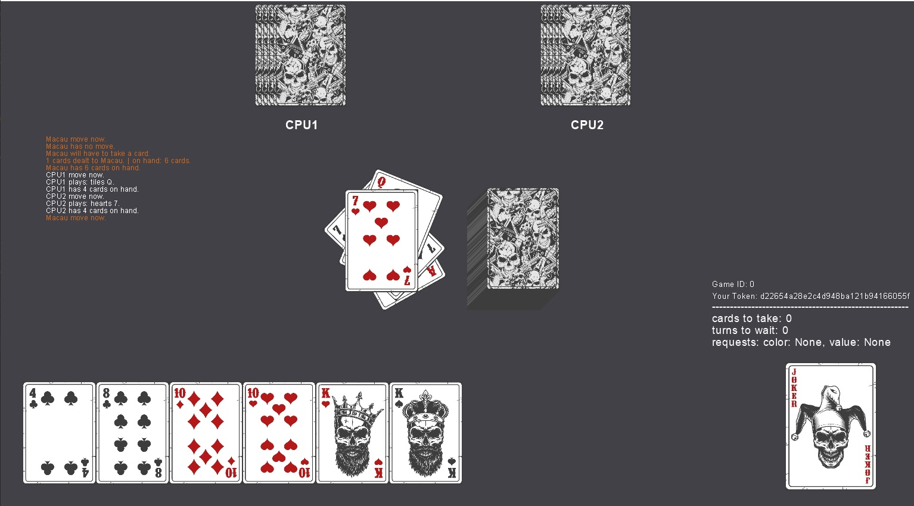
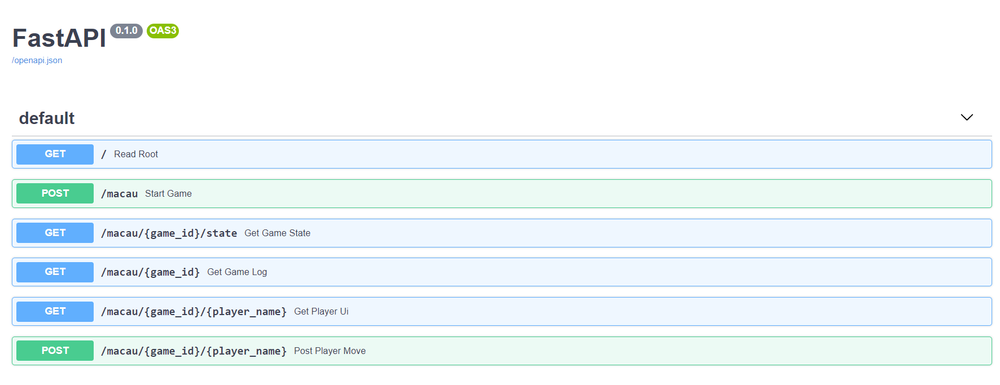
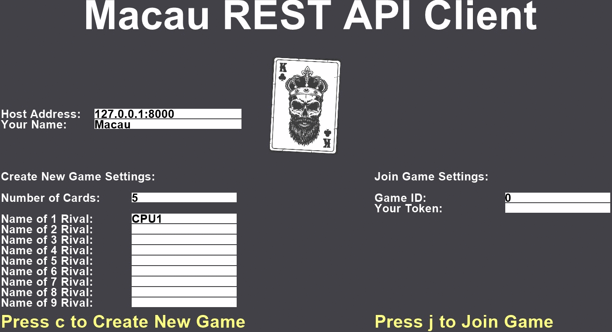

# Macau


The Macau project.  

This is standard [Macau](https://en.wikipedia.org/wiki/Macau_(card_game)) game implementation.  

  
# Installation   
Install the [Miniconda](https://docs.conda.io/en/latest/miniconda.html)
After installation please setup environment with:  
`conda env create -f environment.yml`  
Next change environment with:  
`conda activate macau`  
now you can run the game locally with  
a terminal interface using `python macau.py`.

you can also run REST game server using `uvicorn macau_server:app`  
then you can play with REST client using `python macau_tui_client.py`  
or choose to use REST GUI client using `python macau_gui_client.py`

There are unit tests for this project.  
You can run tests using `python -m pytest ./tests` in project directory.


# Features  
There is many possible ways to play macau with this project.   
Details below:  
## Terminal Game Application  

  

After start of `macau.py` script you will see:  
```
Welcome to Macau Game!
How many players will play?:
```
You can choose any number of players bigger than 2.  
After you enter number of players you need to enter starting number of cards:  
```
Welcome to Macau Game!
How many players will play?: 2
How many cards on start?:
```
You can choose any number of players bigger than 3.  
Number of decks will be calculated.  
Next step is to enter names of all players:  
```
Welcome to Macau Game!
How many players will play?: 2
How many cards on start?: 3
Game will be played with 1 decks.
Enter name for player#1 :
```
If name of player contains `CPU` then this player will be controlled by a computer.  
This means that player with name `Test_CPU` will be cpu-player.  
Game window looks like:
```
Grzesiek Turn Now!

Grzesiek
---------------------Punishments---------------------
Cards: 0
Skip turns: 0
----------------------Requests-----------------------
Color: hearts
Value: None
----------------------Players------------------------
Grzesiek has: 2 cards on hand.
Aga has: 2 cards on hand.
-----------------------Table-------------------------
Cards in deck: 31
Cards on table: 16
On top: tiles A
------------------------Hand-------------------------
tiles 5, *hearts 4*
-----------------------------------------------------
*color value* -> means that this card can be played
Which card(s) from your hand do you want to play?:
```

Cards which you can play are marked with stars `*`.  
You can play card from your hand with `color value` line.  
For example: `hearts 3`  

If you have pack of cards on your hand e.g. like: `hears 7, tiles 7, pikes 7`  
then you can put on table all of them in one move.  
Pack is 3 or 4 cards with same value, jacks, aces, queens, 2, 3 and 4 included. 

### CPU self play
If all players in game will have `CPU` inside their name,   
then only cpu players will play macau.  
In such a case, the game window will look like:  
```
CPU_A move now.
CPU_A plays: tiles A.
CPU_A plays: clovers.
CPU_A has 5 cards on hand.
CPU_B move now.
CPU_B plays: clovers J.
CPU_B plays: 9.
CPU_B has 1 cards on hand.
CPU_A move now.
CPU_A has no move.
CPU_A will have to take a card.
1 cards dealt to CPU_A. | on hand: 6 cards.
CPU_A has 6 cards on hand.
CPU_B move now.
CPU_B plays: tiles 9.
CPU_B has 0 cards on hand.
Game won by CPU_B
```

## REST API Game Server  
   

This project can be run as a REST API server.  
with command `uvicorn macau_server:app` you can run it locally.   
Then with available commands it is possible to play from a browser.  
It is possible - but effortful, because you will need to use swagger.  
All documentation is available to read at `http://localhost:8000/docs`


## REST API Terminal Game Client
Another way to play is to use REST API Terminal Game Client.   
You can run the terminal client from with command:  
`python macau_tui_client.py`

Then you will see inside terminal window:
```
Welcome to Macau Game!
Connection to Game Server checked.
Do you want to Create game, Join existing one or Watch? (c/j/w): 
```

From this place you can:
  * create new macau game with `c`
  * join existing game with `j`
  * watch existing game as a spectator with `w`

for example if you choose `c`, then you will see inside terminal:
```
Welcome to Macau Game!
Connection to Game Server checked.
Do you want to Create game, Join existing one or Watch? (c/j/w): c
Creating new Macau Game!
Enter number of players: 3
How many cards on start?: 7
Enter your name: Macauer
Enter name for player#2: CPU1
Enter name for player#3: MasterCPU
Game created. Game ID: 0
Confirm ID by pressing Enter...
```  
Confirm is used to show Game ID. Share Game ID with other human players.  
After confirm. you will see:
```
Macauer move now.

Macauer
-------------------------Punishments-------------------------
Cards: 0
Skip turns: 0
--------------------------Requests---------------------------
Color: None
Value: None
--------------------------Players----------------------------
Macauer has: 7 cards on hand.
CPU1 has: 7 cards on hand.
MasterCPU has: 7 cards on hand.
---------------------------Table-----------------------------
Cards in deck: 29
Cards on table: 2
On top: tiles K
---------------------------Hand------------------------------
hearts 2, hearts 5, hearts 6, hearts 7, *tiles 9*,
*tiles 10*, hearts 10
-------------------------------------------------------------
*color value* -> means that this card can be played
Which card(s) from your hand do you want to play?:
```

Be sure to run API Game Server first!  
To run server just type in another terminal window: `uvicorn macau_server:app`  

## REST API GUI Game Client  
  

Yet another way to play is to use REST API GUI Game Client.   
You can run the graphical client with command:  
`python macau_gui_client.py`

After you run application, you can create new game or join existing game.  
To create new game you need to fill edit boxes on the left side of window.  

To join game the first time you need to enter correct host,  
your name in game and game id on right side of window.

After you create or join game you will see game window like this:  
  


# Rules 

If you play jacks, then you can request cards with chosen value.  
If you play aces, then you can request cards with chosen color.

Cards with values of 2 and 3 are used to attack other players,  
if a player fails to defend against these cards he/she will have to draw  
additional cards from the deck.

Cards with value of 4 are used also to attack other players,  
if a player fails to defend against it - then will have to skip some turns.

King of pikes will punish with cards player behind current player  
with no chance for defend.  
King of hearts will add 5 cards to penalty for next player.  

If no special card is on a table, then rule `All on Queen, Queen on all` applies.

When one player will have only one card left on hand,  
then `Name has Macau!` message will be shown on top of player screen.  

Game will end if one or more players finish round with no cards on hand.

# Development
This project is starting point for more complex development.
+ implemented:
  + macau card game logic for 1 deck and max 6 players
  + terminal interface
  + cpu players
  + macau can be played with more than 1 deck and more than 6 players
  + cpu players can play with packs of card
  + REST API server for macau card game
  + REST API client with terminal ui
  + REST API client with graphical ui

# License

MIT License

Copyright (c) 2021 Grzegorz Maciaszek
